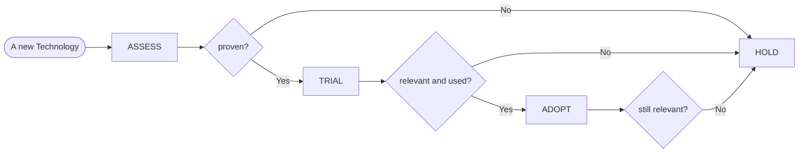

We use tech radar as a tool to support and inspire teams on choosing the most suited technology for new projects and features.

Moreover, the tech radar can provide a place to share knowledge and experiences, by keeping a reference of technical decisions and observations.

On tech radar you can find a list of frameworks, tools, and platform, sliced by following criteria:

* *ADOPT* - Technologies we have high confidence in to serve our purposes. **Low risk and recommended** to be widely used.
* *TRIAL* - Technologies that we are using and have seen to solve a real problem. Slightly **more risky** than adopt, and with limited shared knowledge across organization.
* *HOLD* - Technologies not recommended to be used for new project. Used previously by some teams or all teams, but superseded by other technologies.  Ideally, **should be dismissed** as soon as possible on exiting projects.
* *ASSESS* - Technologies used in our organization, but unproven. You may find teams that have started a prototyping effort, but invest on them has the **higher risks**.

# Technology Life Cycle
 
Ideally, technologies in Casavo should have the following life cycle:

Note that:
* a technology can move out from **ASSESS** if proven to fit its scope inside Casavo; previous chart shows it can move to **TRIAL**, but jump to **ADOPT** is admitted
* advancement from **TRIAL** to **ADOPT** is related to our confidence on the technology, i.e. if it really fits its scope in Casavo and any team can knows it.

# How to Assess a New Technology

For a new technology, in order to be used as **ASSESS** the following conditions must be true:

* no other technology in Casavo is serving the exact same purpose or ...
* ... the new technology will eventually supersede the used one if proven
* it is a reference technology for its scope
* it is community supported and maintained
* it has no specific legal constraints

Other criteria you could evaluate are:

* project age and maturity
* release velocity and stability
* security
* standards and ecosystem
* usability in non-production environment
* cost (particularly relevant for infrastructural technologies and tools)

> **NOTE** Same criteria should be evaluated and applied for other technological *blips*
> that will not appear on tech radar, for instance GitHub Actions or single project dependencies.
> Due the wide and large amount of dependencies we need to build working software, only main 
> *blips* will be added on tech radar itself.
