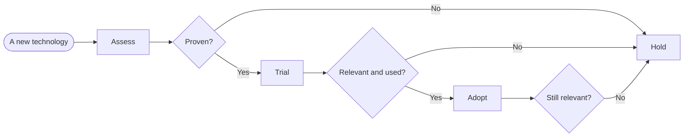

# Choosing technologies

How we decide whether to bring a new technology into Casavo, and how we treat the ones we already
use. "Technology" means a language, framework, tool, platform or technique; the same reasoning
applies, on a smaller scale, to a single library or a CI action.

## Where a technology stands

Every technology we use is in one of four states:

- **Adopt**: we have high confidence it serves our purposes. Low risk, recommended for wide use.
- **Trial**: we use it and have seen it solve a real problem, but shared knowledge is still
  limited. Somewhat riskier than Adopt.
- **Assess**: in use somewhere, but unproven: typically a prototype or a first project. The
  highest risk; invest in it knowingly.
- **Hold**: not to be used for new work. Used before, but superseded; ideally removed from existing
  projects as soon as it is practical.

## Life cycle

- A technology leaves **Assess** once it has proven to fit its scope; it usually moves to Trial,
  but can go straight to Adopt.
- It moves from **Trial** to **Adopt** when we are confident it fits its scope and the whole team
  can work with it.

## Assessing a new technology

Before a new technology enters Assess, all of these must hold:

- nothing we already use serves the same purpose, or the new one is meant to replace it if it
  proves itself;
- it is a reference technology for its scope;
- it is supported and maintained by an active community or vendor;
- it has no specific legal constraints.

Other criteria worth weighing:

- age and maturity of the project;
- release pace and stability;
- security record;
- standards and ecosystem;
- how well it works outside production (local development, tests, CI);
- cost, especially for infrastructure and tools.

Record the decision, and the reasons for it, next to the code it affects (an architecture decision
record in the repository is the usual place), so the next person can see why it was chosen.
